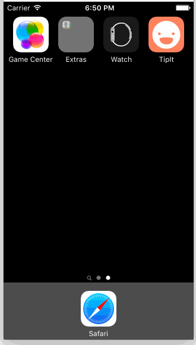

# Pre-work - Tip Calculator

TipIt is a tip calculator application for iOS.

Submitted by: Michelle Venetucci Harvey

Time spent: 8 hours spent in total

## User Stories

The following **required** functionality is complete:
* [x] User can enter a bill amount, choose a tip percentage, and see the tip and total values.

The following **optional** features are implemented:
* [x] Custom font
* [x] UI animations (Animate with Duration)
* [ ] Making sure the keyboard is always visible and the bill amount is always the first responder
    * Note: I opted to still require a tap when the app loads, but see additional feature below for first responder implementation.

The following **additional** features are implemented:

- [x] Custom positioning via translations 
- [x] Hiding/showing states with alpha
- [x] Implemented a custom control for tip amounts instead of the segmented controller
- [x] Added empty and fill image states for custom control ratings
- [x] Implemented first responder interaction where user can tap anywhere to begin, which focuses the keyboard. After initial tap, user has to tap billField to bring up the keyboard.
- [x] Refactored type coercion syntax for creating a double
- [x] Added custom app icon and launch image

## Video Walkthrough 

Here's a walkthrough of implemented user stories:

GIF created with [LiceCap](http://www.cockos.com/licecap/).

## Notes

It took a while to figure out how to animate the first time someone taps the number pad (not when the number pad first shows). I tried all the IBActions before realizing that it's not an IBAction. I had make my UIViewController the delegate for the text field so I could use shouldChangeCharactersInRange.

For the Custom Control, I adapted the custom control from the [Apple Foodtracker tutorial](https://developer.apple.com/library/ios/referencelibrary/GettingStarted/DevelopiOSAppsSwift/Lesson5.html#//apple_ref/doc/uid/TP40015214-CH19-SW1). The basics were the same, but some of the functinality was different - I created an array for the three ratings images and then hooked that up to the tip and total text inputs. 

## License

    Copyright 2015 Michelle Venetucci Harvey

    Licensed under the Apache License, Version 2.0 (the "License");
    you may not use this file except in compliance with the License.
    You may obtain a copy of the License at

        http://www.apache.org/licenses/LICENSE-2.0

    Unless required by applicable law or agreed to in writing, software
    distributed under the License is distributed on an "AS IS" BASIS,
    WITHOUT WARRANTIES OR CONDITIONS OF ANY KIND, either express or implied.
    See the License for the specific language governing permissions and
    limitations under the License.
